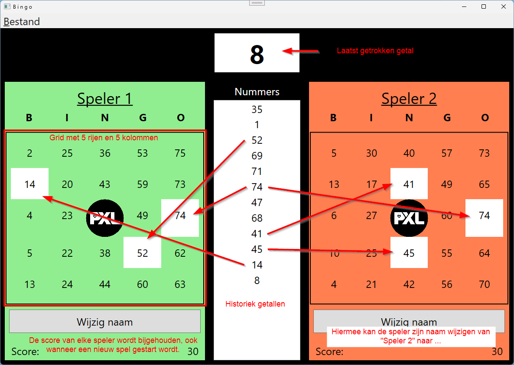

# Bingo 
## Intro
In deze oefening maak je het spel *Bingo*. 

## Het spel
Het spel bestaat uit een raster van 5x5 vakjes. In elk vakje staat een getal. 
De getallen zijn willekeurig gekozen uit de reeks 1 t/m 75. 
De getallen in de kolommen zijn altijd binnen een bepaalde reeks. 
- de eerste kolom bevat getallen 1 t/m 15 
- de tweede kolom bevat getallen 16 t/m 30 
- de derde kolom bevat getallen tussen 31 en 45
- de vierde kolom bevat getallen tussen 46 en 60
- de vijfde kolom bevat getallen tussen 61 en 75
- de middelste cel van het raster is leeg
- **een getal mag maar 1 keer voorkomen in het raster**

De speler wint als hij een rij of kolom vol heeft.

## De opdracht
### XAML
- Maak een Menu met de opties om een nieuw spel te starten en om de applicatie af te sluiten
- Maak een Grid met 5 rijen en 5 kolommen en plaats in elk vakje een Label (zonder *Content*). In het middelste vakje plaats je geen Label, maar een Image.
- Plaats naast de Grid een ListBox, deze zal dienen om de getrokken nummers te tonen.

### C#
- Maak een methode *GeneratePlayerCard* die een *Grid* als parameter heeft en een 2D Array van Labels retourneert:

    - Maak een 2D array aan van Labels met 5 rijen en 5 kolommen
    - Maak een array van Labels die alle Labels van de *Grid* bevat.
    ```csharp
        Label[] gridLabels = playerGrid.Children.OfType<Label>().ToArray();

        foreach (Label label in gridLabels)
        {
            int row = Grid.GetRow(label);
            int col = Grid.GetColumn(label);
            ...
        }
    ```
    - Genereer nu voor elk Label een willekeurig getal dat voldoet aan de voorwaarden van het spel.
    - Zorg dat de Content van het Label correct wordt opgevuld met dit willekeurig getal en bewaar het Label in de 2D array in de juiste rij en de juiste kolom.
    - Retourneer de 2D array van Labels wanneer alle Labels zijn ingevuld.
- Bij het starten van een nieuw spel: 
    - moet de methode *GeneratePlayerCard* aangeroepen worden, bewaar de geretourneerde 2D array van Labels in een klasse variabele.
    - wordt er een timer gestart die elke 5 seconden een willekeurig getal uit de reeks 1 t/m 75 genereert
        - zorg dat elk getal maar 1 keer getrokken kan worden per spel
        - bewaar dit getal in een Array *bingoNumbers* en voeg dit getal toe aan de ListBox
- Controleer na elke trekking van een getal:
    - of dit getal voorkomt in de 2D array van Labels. Zo ja, wijzig dan de achtergrondkleur van het Label en doorstreep de Content van het Label.
    - of er een rij of kolom vol is. Zo ja, stop dan de timer en toon een MessageBox met de boodschap dat de speler gewonnen heeft.

## Extra
- Zorg ervoor dat het spel gespeeld kan worden met 2 spelers
- Hou een score bij van het aantal gewonnen spellen per speler
- ... (eigen ideeën zijn altijd welkom)

## Voorbeeld Layout
*Dit is enkel een voorbeeld, wees creatief en gebruik je kennis om een unieke applicatie te maken*

